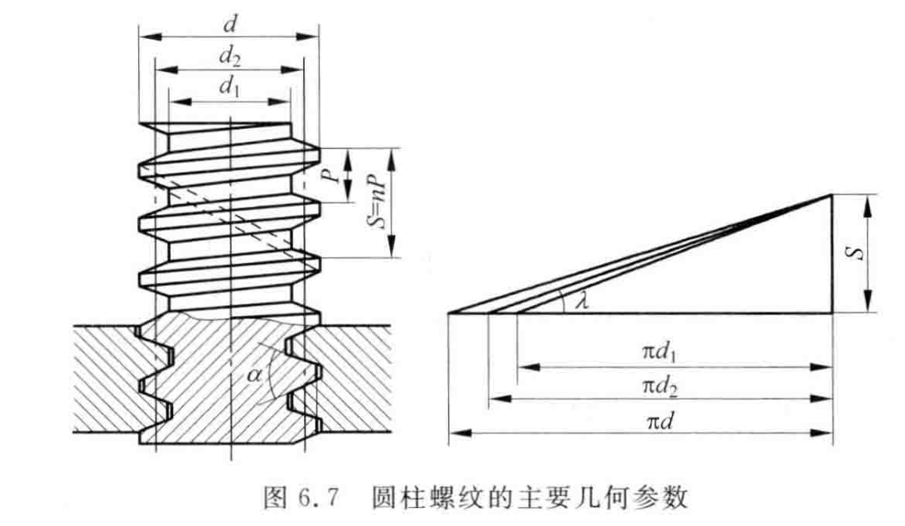

# 螺纹连接和传动

## 螺纹主要参数和常用类型
>
> 外螺纹 内螺纹  
右旋螺纹 左旋螺纹  
单线螺纹 双线螺纹 三线螺纹  

**大径**$d(D)$ 与外螺纹牙顶相切圆柱面的直径  
**小径**$d_1(D_1)$ 与外螺纹牙底相切的圆柱面直径  
**中径**$d_2(D_2)$ 处于大径和小径之间的一个假象圆柱面的直径。在该圆柱的母线上螺纹牙厚度与牙槽宽度相等。  
**螺距**$P$ 相邻两螺纹牙上对应点之间的轴向距离。  
**导程**$P_h$ 螺纹上任意一点沿螺旋线绕一周所移过的轴向距离。 $P_h=zP$ ,$z$为螺纹线数。  
**升角**$\lambda$   如图上所示
$$\tan \lambda=\frac{P_h}{\pi d_2}$$  

## 受力分析、效率和自锁

## 矩形螺纹

$F_Q$ 为其轴向载荷  
$\rho$ 为摩擦角 $\rho =\arctan f$  

拧紧螺母所需的转矩
$$T=F_Q \tan(\lambda+\rho)$$
松脱螺母所需的转矩  
$$T=F_Q \tan(\lambda - \rho)$$  
**效率**  
$$\eta =\frac{\tan \lambda}{\tan(\lambda+\rho)}$$  

**自锁条件**  
$$\lambda \le \rho$$

## 非矩形螺纹  

当量摩擦系数
$$f_v=\frac{f}{\cos \gamma}$$  
当量摩擦角
$$\rho _v =\arctan f_v$$  
拧紧螺母所需的转矩
$$T=F_Q \tan(\lambda+\rho)$$
**效率**  
$$\eta =\frac{\tan \lambda}{\tan(\lambda+\rho_v)}$$  
**自锁条件**  
$$\lambda \le \rho$$  
$$牙型斜角\gamma \uparrow,则f_v\uparrow, \rho \downarrow. 但自锁性能越好$$

## 强度计算  

### 松螺栓连接  

$$d_1\ge \sqrt{\frac{4F_Q}{\pi \left [ \sigma \right ]}} $$  

### 紧螺栓连接

#### 受横向载荷

$$\sigma _v = \frac{4\times 1.3F_{Q0}}{\pi d_1^2}\le  \left [ \sigma \right ] $$  
铰制孔螺栓连接剪切及挤压强度条件
$$\tau = \frac{4F}{\pi d_1^2}\le  \left [ \tau \right ]$$
$$\sigma _p = \frac{F}{d_0 h}\le  \left [ \sigma_p \right ] $$  

#### 受轴向载荷  

$$F_{q\Sigma}=F_Q+F_{Qr}$$
$$\sigma _v = \frac{1.3F_{Q\Sigma}}{\frac{\pi}{4} d_1^2}\le  \left [ \sigma \right ] $$
一般链接,外载荷稳定
$$F_{Qr}=(0.2\sim0.6)F_Q$$
外载荷变动
$$F_{Qr}=(0.6\sim1.0)F_Q$$
紧密性要求  
$$F_{Qr}=(1.5\sim1.8)F_Q$$  
