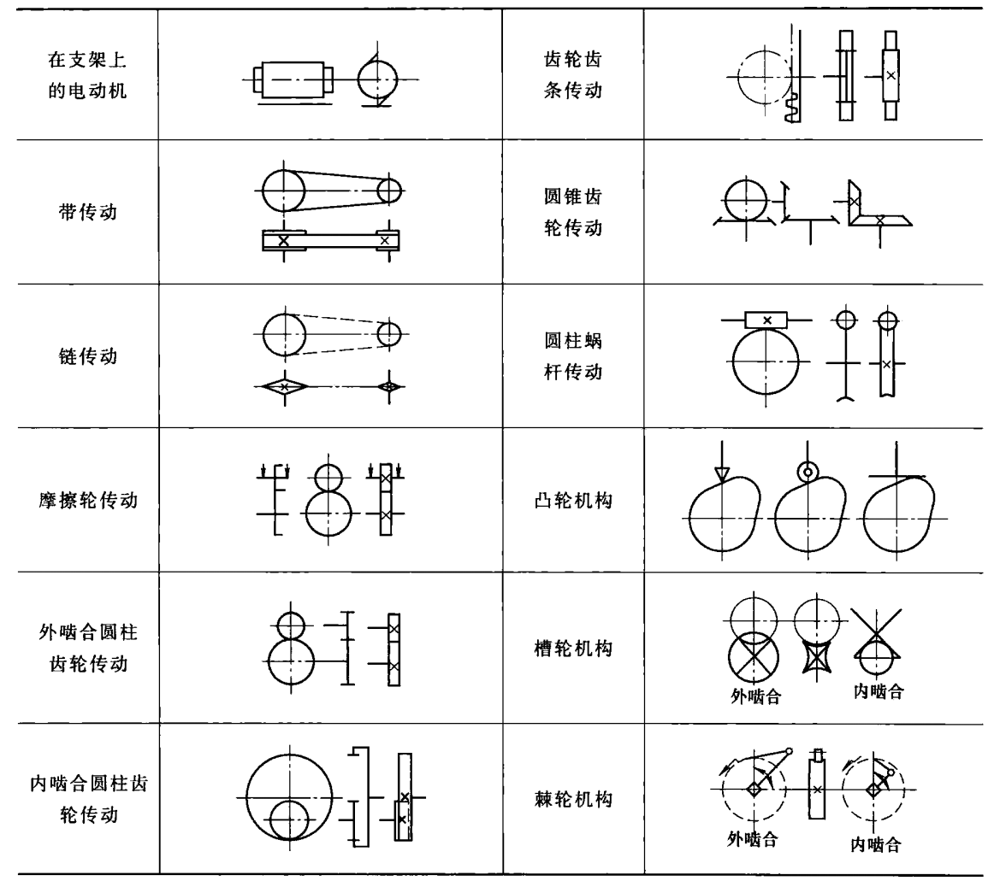

# 运动简图及自由度

## 运动副及其分类

由两个构件直接接触组成的具有一定的相对运动的可动连接称为运动副。

### 低副

在平面机构中两个构件通过面接触组成发运动副称为低副  
转动副 移动副

### 高副

点或线接触组成的运动副称为高副

## 平面机构运动简图

## 平面机构的自由度

$N$ 平面机构数  
$n$ 平面机构活动机构数  
$p_L$ 低副个数  
$p_H$ 高副个数  
$F$ 自由度  
一般情况下有  
$$n=N-1 $$  
$$F=3n-2p_L -p_H$$  

### 有确定运动的条件  

主动件数等于机构自由度

### 注意事项

1. 复合铰链  
m个构件在同一连接处构成复合铰链 $(m \ge 2 )$ ，则共有 $m-1$ 个转动副。
2. 局部自由度  
在有些机构中，某些构件所产生的局部运动并不影响其他构件的运动，则称这种局部运动的自由度为局部自由度。  
如滚子推杆凸轮机构中，滚子绕其自身轴线的转动并不影响其他构件的运动，只是一种局部自由度。
3. 虚约束  
有些运动副带入的约束对机构的运动只起重复约束作用，特把这类约束称为虚约束（redundant constraint）

修正后的自由度运算公式  
$$F=3n-(2p_L +p_H - p' )-F'$$
自由度 = 3 *活动构件数 - (2* 低副数 + 高副数 - 虚约束数) - 局部自由度
