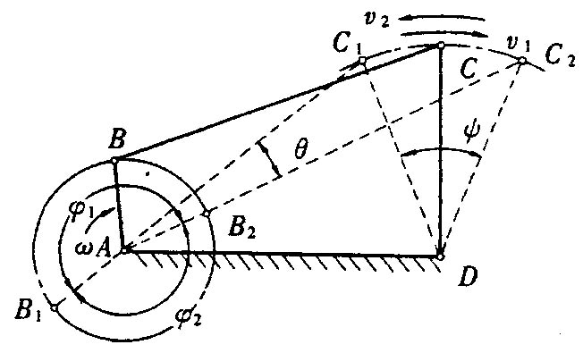
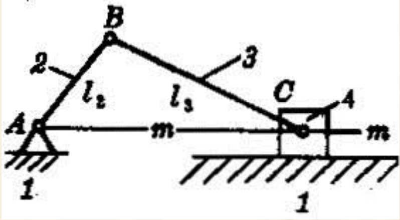

# 平面连杆机构

## 铰链四杆机构的基本形式和性质

分为曲柄摇杆机构、双曲柄机构和双摇杆机构

### 曲柄摇杆机构

  

性质  

1. 急回运动  
$\theta$ 极位夹角  
行程速度变化系数 $K$
$$K=\frac{180^{\circ}+\theta}{180^{\circ}-\theta}$$
$$\theta =180^{\circ} \frac{K-1}{K+1}  $$
2. 压力角和传动角  
压力角 $\alpha$ ：力与速度正方向之间的夹角，越小越好  
传动角 $\gamma$ ：压力角的余角，越大越好  
工程上一般 $\gamma_{min} \ge 40^{\circ}$

3. 死点位置(从动件和连杆共线处)

* 压力角 $\alpha = 0$ 传动角 $\gamma = 90^{\circ}-\alpha = 0$
* 机构被卡死，运动不确定

### 双曲柄机构

平行四边形机构  

* 无急回运动
* 有死点位置
* $\gamma_{min}=0$  

**双摇杆机构**略

### 曲柄存在条件

* 最短杆与最长杆长度之和不大于其余两杆长度之和
* 连架杆和机架中有一杆为最短杆

**如果最短杆与最长杆长度之和小于或等于其余两杆长度之和：**  

1. 如果以最短杆的相邻杆为机架，存在一个曲柄，为曲柄摇杆机构；
2. 如果以最短杆为机架，为双曲柄机构；
3. 如果以最短杆的对面杆为机架，为双摇杆机构；
4. 两对边杆分别相等的铰链四杆机构，不论取哪个杆为机架，均为双曲柄机构，即平行双曲柄机构。

**如果最短杆与最长杆长度之和大于其余两杆长度之和，无论以哪个杆作机架，均为双摇杆机构。**

### 铰链四连杆机构的演化

#### **曲柄滑块**

**对心曲柄滑块**

* 滑块行程 $C_1 C_2 = 2l_2$
* $\theta = 0$
* 曲柄存在条件 $l_2 \le l_3$
* 当曲柄与滑块的动方向垂直时，传动角最小  

偏置曲柄滑块

* $\theta \ne 0$
* 曲柄存在条件 $l_2 +e\le l_3$

**导杆机构**略
