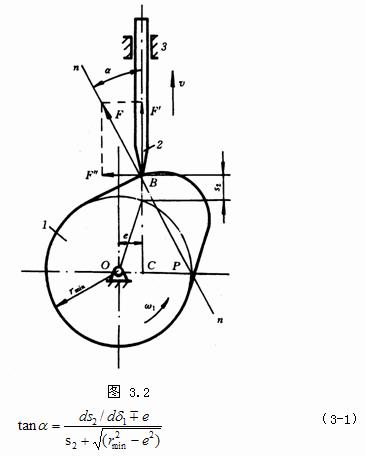

# 凸轮机构

## 凸轮机构的应用和分类

应用略  

分类  

* 按凸轮形状  
    1. 盘型凸轮
    2. 圆柱形凸轮
* 按从动件的形式分  
    1. 尖顶从动轮
    2. 滚子从动轮
    3. 平底从动轮

## 从动轮常用的运动规律

* 等速运动规律  
  刚性冲击 （瞬时加速度趋向无穷）用于于低速、轻载的凸轮机构
* 等加速或等减速运动规律  
  柔性冲击 （减速度发生有限值突变）适用于中速、轻载场合
* 余弦加速度运动规律  
  开始和终止时有柔性冲击 用于中速、中载场合  
  当从动件作连续运动时，可用于高速。

## 凸轮机构的压力角与基圆半径

### 压力角及其许用值

*压力角*: 从动件所受驱动力方向与其运动方向之间所夹的锐角。
$$F_y = Fcos \alpha$$
$$F_x = Fsin \alpha$$

凸轮机构的自锁: 从动件在驱动力作用下, 所引起的摩擦力使机构不能产生运动的现象。  
压力角标志着机构的传力性能压力角越小，传力性能越好  
极限压力角：机构开始自锁时的压力角。  
许用压力角：设计凸轮机构时允许采用的最大压力角。

### 压力角与基圆半径

$$r=r_0 +s_2$$
$$r_0=\frac{v_2}{\omega_1 tan\alpha }-s_2$$

当 $\omega_1,v_2,s_2$ 一定时，如果要减小基圆半径 $r_0$ ,就要增大压力角 $\alpha$

## 间歇运动机构

### 棘轮机构

### 槽轮机构  

周期：槽轮机构完成一个运动循环所用的时间。  
运动系数：在一个运动循环内，槽轮运动时间与
周期的比。
$$K=\frac{t_d}{t_j}$$

#### 单销拨盘

$$K=\frac{z-2}{2z}$$
 $z$ 槽轮槽数  
K=0时，表示槽轮始终不动，与实际运动不符  
K必须大于0，即z≥3（整数）， $z_{min}=3$  
K<1/2，即槽轮每次的运动时间总是小于停歇时间

#### 多销拨盘

$$K=\frac{n(z-2)}{2z}$$
如果K=1，槽轮作连续转动即：
$$n<\frac{2z}{z-2}$$
>z=3时，n＝1～5  
z＝4或5时，n＝1～3  
z≥6时，n＝1～2  
z=3时，n＝1～5
z＝4或5时，n＝1～3
z≥6时，n＝1～2

槽轮槽数z＝4～8

****
**凸轮机构：凸轮是原动件**  
**棘轮机构：棘轮是从动件**  
 **槽轮机构：槽轮是从动件**  
 不完全齿轮机构  
 凸轮式间歇机构
